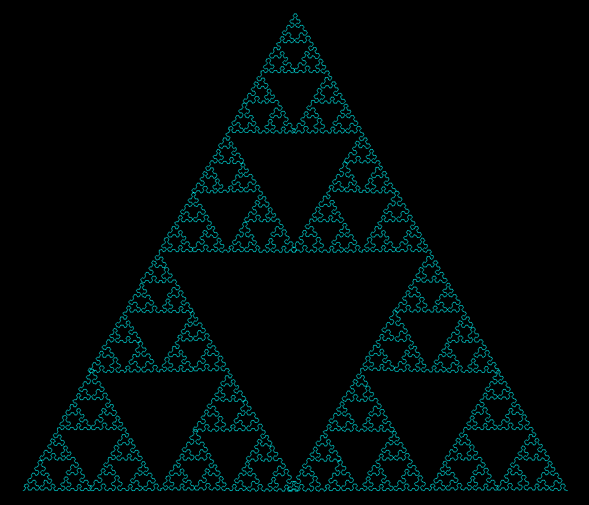
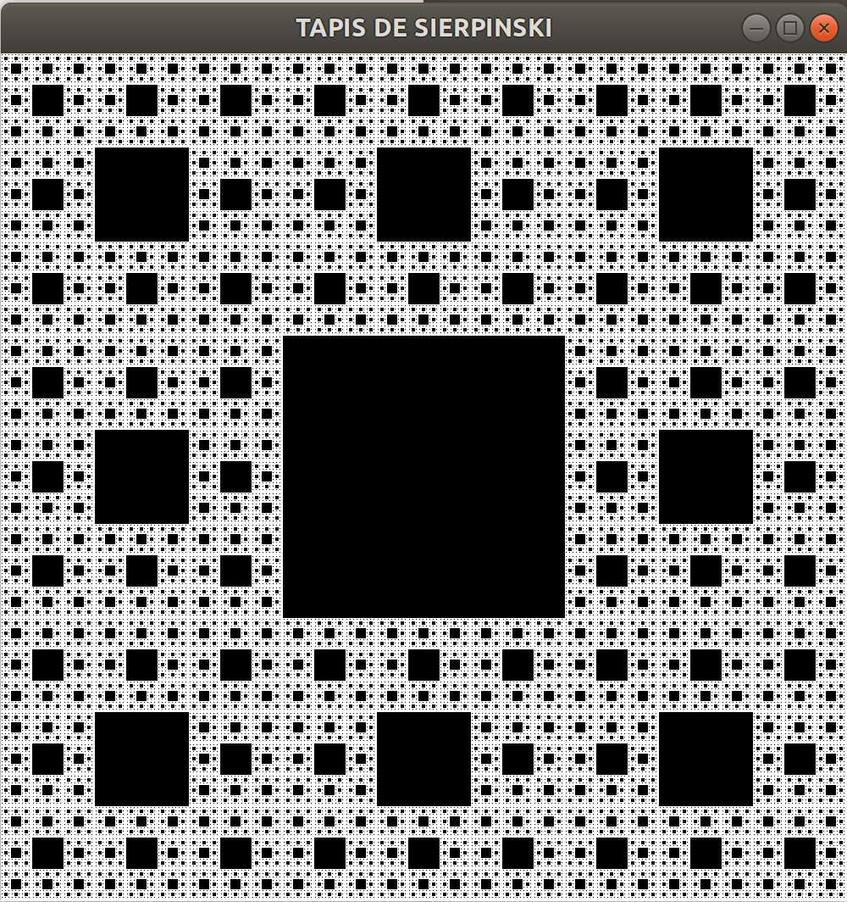

# TP07

This repository contains source code of TP07 parts of Phelma's scholarship
https://tdinfo.phelma.grenoble-inp.fr/1AS1/td2.html

You will need SDL1.2 and SDL_draw librairies in order to compile this project.

https://www.libsdl.org/download-1.2.php

http://sdl-draw.sourceforge.net/

**Quelques Resultats :**

Sierpiski à l'ordre 8 :

Le tapis de Sierpinski à l'ordre 6 :

